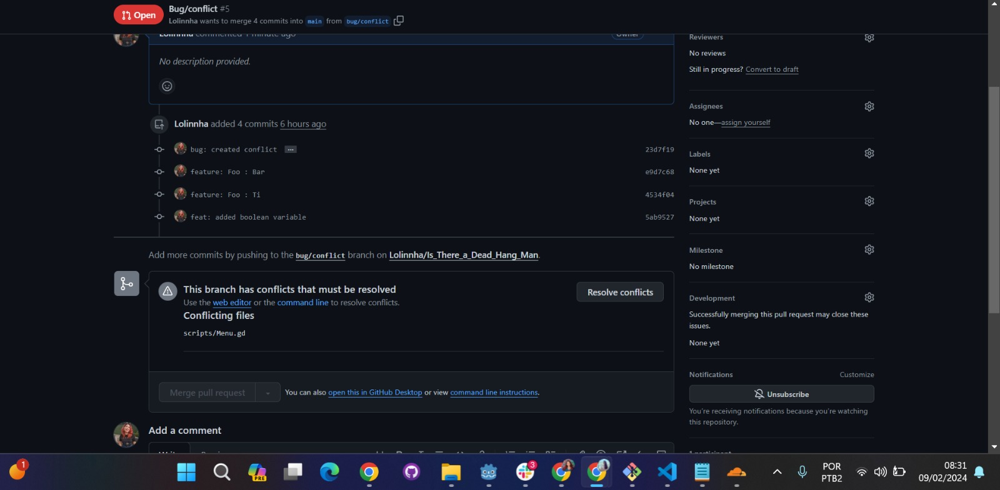
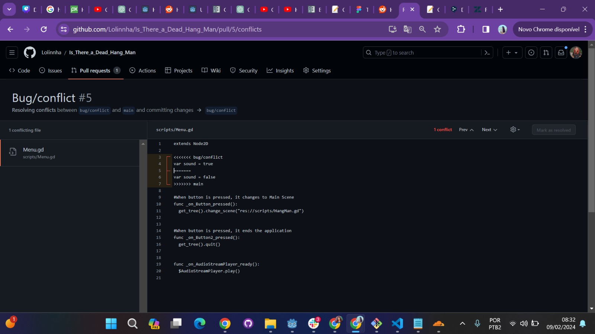
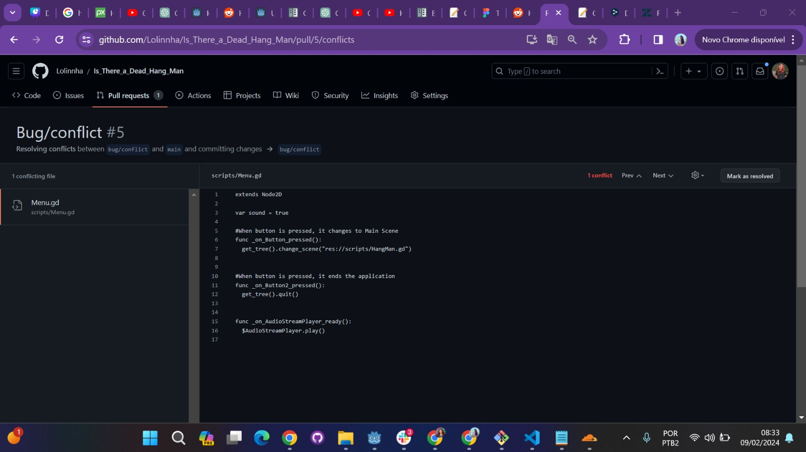

# Is_There_a_Dead_Hang_Man

Is There a Dead Hang Man é um jogo da forca com estilo de terror. A jogabilidade é bem voltada à infância, com a possibilidade de 5 erros para completar a palavra e deve ser escolhida uma letra (vogal ou consoante) a cada turno. 

# Propósito de Cada Commit Principal

A seguir, serão demonstrados os commits de maior relevância para a execução da aplicação:

* "feat: added menu screen" focado em adicionar o código e a tela de menu com assets de texto, botões e background 
* "feat: added hang man screen" focado em adicionar botões com vogais e consoantes, background e a lista de palavras que serão usadas
* "feat: Added Hangman code" focado em adicionar funções que obtêm as palavras, transformam-nas em letras e obtêm o comprimento de cada uma delas
* "feat: Added Hangman code" focado em ocultar as letras das palavras que serão chamadas randomicamente
* "bug: created conflict" focado em modificar a posição dos parâmetros e atributos booleanos, porém não consegui realizar o conflito nessa branch
* "feat: path for Hang Man Screen" focado em adicionar o caminho para a próxima cena quando clicar no botão de iniciar o jogo
* "Merge pull request #5 from Lolinnha/bug/conflict" merge mais atual (ao total foram 5 merges)
* "feat: added boolean variable" focado em começar o conflito inicial adicionando a variável booleana que será modificada
* "feat: false sound boolean variable" focado em realizar o conflito modificando a variável em outra branch
* "Merge branch 'main' into bug/conflict" conflito realizado e resolvido
* "Update README.md" focado em atualizar o Read explicando a descrição da aplicação e trazendo o propósito de cada commit principal

# Conflito 

O conflito foi realizado pela mudança de uma variável booleana "sound" para true e false em diferentes branchs. A seguir, terão imagens para comprovar a realização do conflito e sua resolução. 

Figura 1 - Comprovação da geração do conflito no GitHub

 

Figura 2 - Demonstração do conflito envolvendo a variável booleana no Godot

 

Figura 3 - Resolução do conflito ao escolher o valor "true" para atribuição na variável booleana

